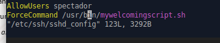

  

# Created by Pau gradoli

# OPERA AT NIGHT FILES

## Here we have the location and configuration of ssh acces. 

Click to see Index

* ### [Preparations of the opera](https://github.com/Akirachii/SOX/blob/main/AV2/UD03-OPERA-NIGHT/PREPARATIONS.sh)
  As we start our work we'll need to stablish users and permissions, this script helps us with that.

* ### [Preparations of act 1](https://github.com/Akirachii/SOX/blob/main/AV2/UD03-OPERA-NIGHT/ACT01.sh)
    Then at act 1, we'll create the starter of opera with four works and its basic notes for each instrument. 

* ### [Preparations of act 2](https://github.com/Akirachii/SOX/blob/main/AV2/UD03-OPERA-NIGHT/ACT02.sh)
    Next, act 2 will work as the first and adding special works on the basic works.

* ### [preparation of act 3](https://github.com/Akirachii/SOX/blob/main/AV2/UD03-OPERA-NIGHT/ACT03.sh)
    Next, act 2 will work as the 1st & 2nd and adding special works on the basic workspaces.

* ### [Preparations of act 4](https://github.com/Akirachii/SOX/blob/main/AV2/UD03-OPERA-NIGHT/ACT04.sh)
    Next, act 2 will work as the 1st, 2nd & 3rd and adding special works on the basic workspaces.

